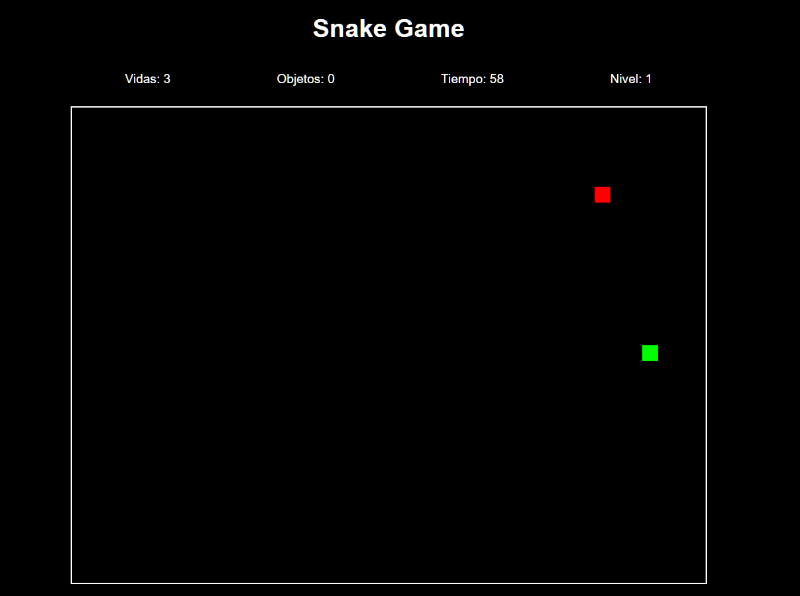

# Snake Game

¡Bienvenido al juego de la serpiente! Este es un clásico juego de arcade en el que controlas una serpiente que se mueve por la pantalla, tratando de comer comida y evitar las colisiones.

## Descripción

Este proyecto consiste en un juego de la serpiente implementado con HTML, CSS y JavaScript. El juego incluye características como niveles, un temporizador, y dos tipos de modales: uno para el final del juego y otro para ganar. 

## Portada:


## Contenidos

- `index.html`: Estructura HTML del juego, que incluye el área del juego y modales.
- `style.css`: Estilos CSS para el diseño del juego y los modales.
- `script.js`: Lógica del juego en JavaScript, incluyendo el manejo de la serpiente, el temporizador y los modales.

## Cómo Jugar

1. **Iniciar el Juego**: El juego comienza automáticamente al cargar la página.
2. **Controlar la Serpiente**: Usa las flechas del teclado (`ArrowUp`, `ArrowDown`, `ArrowLeft`, `ArrowRight`) para mover la serpiente.
3. **Objetivo**: Come los objetos rojos para aumentar tu puntuación. Cada nivel requiere que recojas una cantidad específica de objetos.
4. **Niveles**: Completa los niveles recogiendo la cantidad requerida de objetos. Avanzarás al siguiente nivel si lo logras, y ganarás el juego si completas el último nivel.
5. **Fin del Juego**: El juego termina si pierdes todas tus vidas o si el tiempo se agota.

## Requisitos

- Navegador web moderno (recomendado Google Chrome, Firefox, Safari).
- HTML, CSS y JavaScript habilitados.

## Estructura del Proyecto

- `index.html`: Contiene la estructura básica del juego, el canvas para el juego, y los modales para el final del juego y para ganar.
- `style.css`: Define el estilo del juego, el canvas, y los modales.
- `script.js`: Controla la lógica del juego, incluyendo el movimiento de la serpiente, la colisión, el temporizador y la interacción con los modales.

## Funcionalidades

- **Canvas**: Área de juego donde la serpiente se mueve y come la comida.
- **Modales**: 
  - *Modal de Game Over*: Se muestra cuando el juego termina. Permite continuar o salir.
  - *Modal de Victoria*: Se muestra cuando se gana el juego. Permite continuar o salir.
- **Temporizador**: Contador regresivo que afecta el progreso del juego y el nivel de dificultad.
- **Niveles**: Diferentes niveles con requisitos de comida y tiempos específicos.

## Instrucciones de Instalación

1. Clona el repositorio:
    ```sh
    git clone https://github.com/tu_usuario/nombre_del_repositorio.git
    ```
2. Navega a la carpeta del proyecto:
    ```sh
    cd nombre_del_repositorio
    ```
3. Abre `index.html` en tu navegador web para comenzar a jugar.

## Contribuciones

Si deseas contribuir a este proyecto, por favor sigue estos pasos:

1. Haz un fork del repositorio.
2. Crea una nueva rama (`git checkout -b feature/nueva-funcionalidad`).
3. Realiza tus cambios y asegúrate de que el código esté funcionando correctamente.
4. Envía un pull request para que se revisen tus cambios.

## Licencia

Este proyecto está licenciado bajo la Licencia MIT. Consulta el archivo [LICENSE](LICENSE) para más detalles.

---

¡Disfruta jugando y no dudes en hacer sugerencias o reportar problemas!
